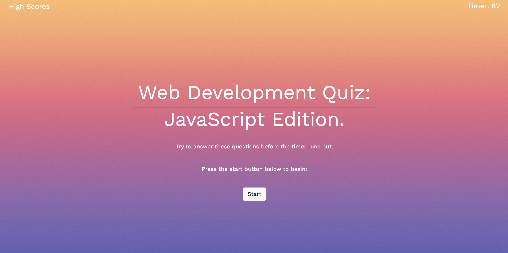

# Web Development Quiz:
## JavaScript Edition. 

&nbsp;

### Project Description:

&nbsp;

For this project I created a multiple choice quiz on the topic of JavaScript. An individual who takes this quiz is given 90 seconds at the start, and is presented with seven questions total. The timer represents the total time alloted for the entire quiz, so they can take as little or as long as they need between each question. If they get a question wrong, they will be aware of their error as ten seconds will be subtracted from the clock. At the end of the quiz, they are given the opportunity to enter their initials, and save their high score. They can attempt the quiz again in an effort to answer all of the questions correctly, and have a larger time amount left on the clock. The user can click the high scores tab, at the top of the screen, to view their best times. This quiz application was constructed using a single HTML file, two JavaScript files, and a CSS file. I utilized the Bootstrap CDN for some elements, and worked with a contemporary font named "Work Sans" that was obtained through google fonts and designed by Wei Huang, a type designer from Australia. 

&nbsp;

&nbsp;

-------------------